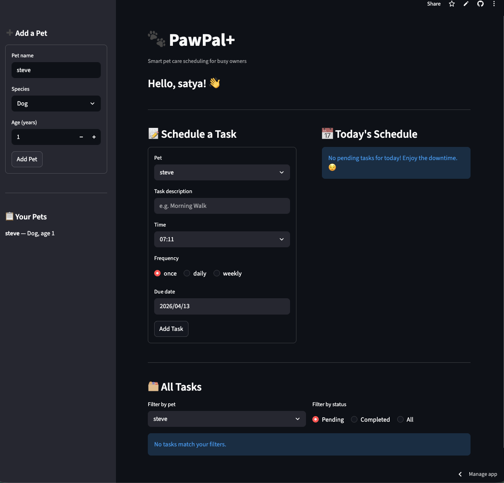

# 🐾 PawPal+

A smart pet care scheduling app that helps busy owners stay on top of daily routines — walks, feedings, medications, and more.

## 📸 Demo



## Scenario

A busy pet owner needs help staying consistent with pet care. They want an assistant that can:

- Track pet care tasks (walks, feeding, meds, enrichment, grooming, etc.)
- Consider constraints (time available, priority, owner preferences)
- Produce a daily plan and explain why it chose that plan

## ✨ Features

### Core
- Add an owner profile and multiple pets (dog, cat, rabbit, etc.)
- Schedule tasks with a time, frequency, and due date
- View today's pending tasks sorted chronologically

### Smarter Scheduling
- **Sorting by time** — all tasks are automatically sorted by HH:MM so the daily schedule is always in order
- **Filtering** — filter the full task list by pet name or completion status (pending / completed / all)
- **Recurring tasks** — marking a `daily` or `weekly` task complete automatically creates the next occurrence (tomorrow or +7 days)
- **Conflict detection** — the scheduler flags any two tasks scheduled at the exact same time on the same date with a ⚠ warning

## 🏗 System Architecture

Four classes make up the logic layer in `pawpal_system.py`:

| Class | Responsibility |
|---|---|
| `Task` | A single care activity — description, time, frequency, due date, completion status |
| `Pet` | Stores pet details and owns a list of tasks |
| `Owner` | Manages multiple pets; provides access to all tasks across all pets |
| `Scheduler` | Sorting, filtering, conflict detection, recurring task logic |

> UML diagram: see `uml_final.png` _(add after Phase 6)_

## 🚀 Getting Started

```bash
python -m venv .venv
source .venv/bin/activate  # Windows: .venv\Scripts\activate
pip install -r requirements.txt
streamlit run app.py
```

## 🖥 CLI Demo

To verify backend logic without the UI:

```bash
python main.py
```

This creates two pets, adds tasks out of order, prints the sorted schedule, demonstrates conflict detection, and shows recurring task creation.

## 🧪 Testing PawPal+

```bash
python -m pytest tests/
```

The test suite covers:

- **Task completion** — `mark_complete()` flips status; `once` tasks produce no follow-up
- **Task addition** — adding a task increases pet task count; completed tasks are excluded from pending
- **Sorting correctness** — tasks are returned in chronological order; empty lists are handled safely
- **Recurrence logic** — completing a `daily` task adds a tomorrow-dated copy to the pet; `weekly` adds +7 days
- **Conflict detection** — same time + same date flags a warning; different dates do not
- **Filtering** — `filter_by_pet()` and `filter_by_status()` return only matching tasks

**Confidence level: ⭐⭐⭐⭐ (4/5)** — all 12 tests pass; edge cases like overlapping task *durations* are not yet covered (see Tradeoffs).

## ⚖️ Tradeoffs

Conflict detection currently only flags tasks at the **exact same HH:MM timestamp**. It does not account for overlapping durations (tasks have no duration field in the current model). This keeps the logic simple and readable but means a 30-minute walk at 08:00 and a feeding at 08:15 would not be flagged.

## 📁 Project Structure

```
├── pawpal_system.py   # Logic layer: Owner, Pet, Task, Scheduler
├── app.py             # Streamlit UI
├── main.py            # CLI demo script
├── tests/
│   └── test_pawpal.py # Automated pytest suite
├── reflection.md
└── README.md
```

## 🤝 Built With

- [Python](https://python.org) — dataclasses, datetime
- [Streamlit](https://streamlit.io) — UI
- [pytest](https://pytest.org) — testing
